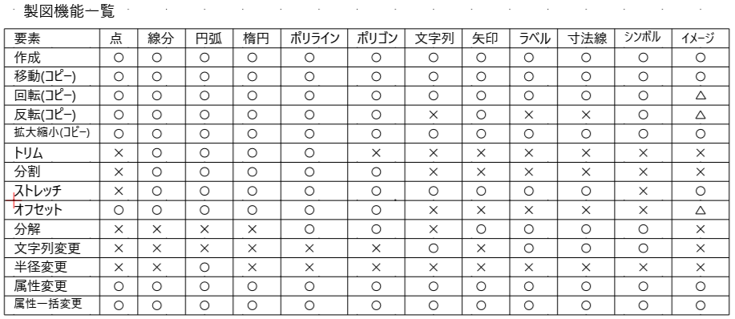
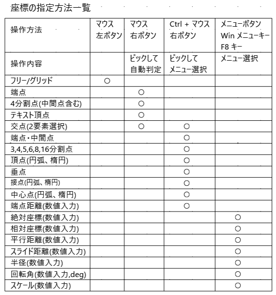
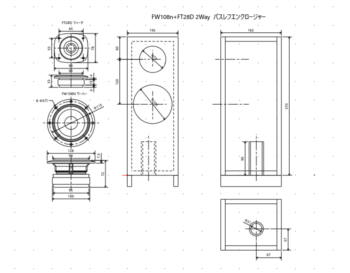

# CadApp
## シンプルに図面の管理ができるCADソフト

ドキュメント作成ツールとしてノートで簡単な製図をするような感覚で使える2次元の機械系CADソフト  
使い方などは[説明書](Document/CadAppManual.pdf)を参照。  
実行方法は[CadApp.zip](CadApp.zip)をダウンロードし適当なフォルダーに展開して CadApp.exe を実行する。  

### ■おもな機能
・図面の管理を大分類、分類、図面名の3段階に分けてシンプルに図面を管理  
・簡単に図面の切替ができ、都度ファイル保存されデータ保存をいしきしなくてよい  
・シンプルなコマンドによる機械系の図面の作成  
・マウスによる操作だけではなくキーボードからの操作も可能  
・図形データからシンボルの作成、配置、管理  
・レイヤーによる図面管理でデータの重ね合わせで部分表示が可能  
・図形データをクリップボードにコピーすることで他の図面にデータの移動が可能  
・複数行の文字列が可能でドキュメント作成としても使える  
・イメージデータをCAD図の中に貼付けられる  

### 起動画面  
  

### 作図機能    
   

   

   

   

   

### 作成図面サンプル  
   

#### シンボルを使った電子回路図  
電子回路用のシンボル図形を作成すると電子回路図も作成しやすい  
  
真空管アンプの回路図  
   

基板の部品配置図  
   

 ###  イメージの貼付け
 

 イメージ図からトレースしてCAD図を作成  

### 履歴
2023/10/18  水平垂直線分、ショートカットキーのカスタム化、文字フォント設定、イメージ要素、スクリーンキャプチャ追加
2023/09/02  楕円要素、シンボル要素の追加、レイヤー機能を追加  
2023/07/26  機能追加(数値計算、領域拡大、ファイルフォーマット、属性変更、要素データのコピー貼付け)  
2023/07/15  実行環境初回登録(プロトタイプ)

### ■実行環境
CadApp.zipをダウンロードして適当なフォルダに展開し、フォルダ内の CadApp.exe をダブルクリックして実行します。  
動作環境によって「.NET 7.0 Runtime」が必要になる場合もあります。  
https://dotnet.microsoft.com/ja-jp/download

### ■開発環境  
開発ソフト : Microsoft Visual Studio 2022  
開発言語　 : C# 10.0 Windows アプリケーション  
フレームワーク　 :  .NET 7.0  
NuGetライブラリ : なし  
自作ライブラリ  : CoreLib

