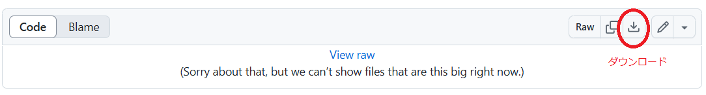
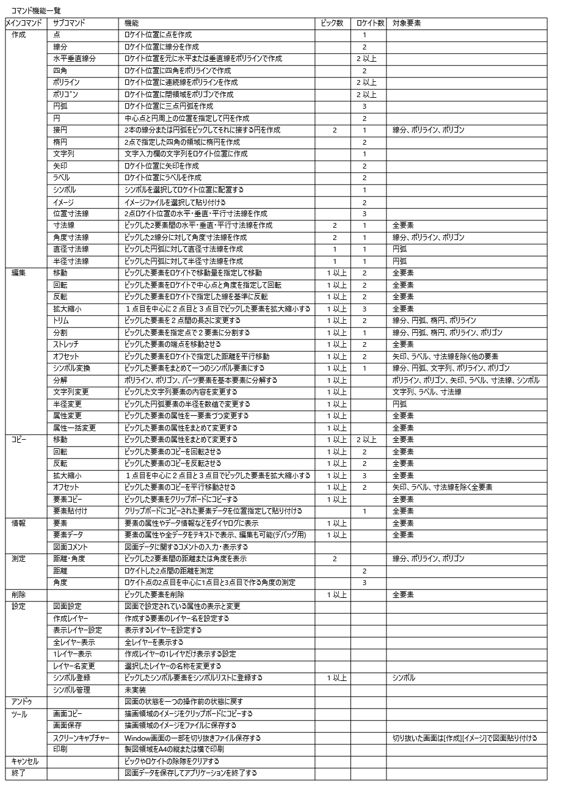
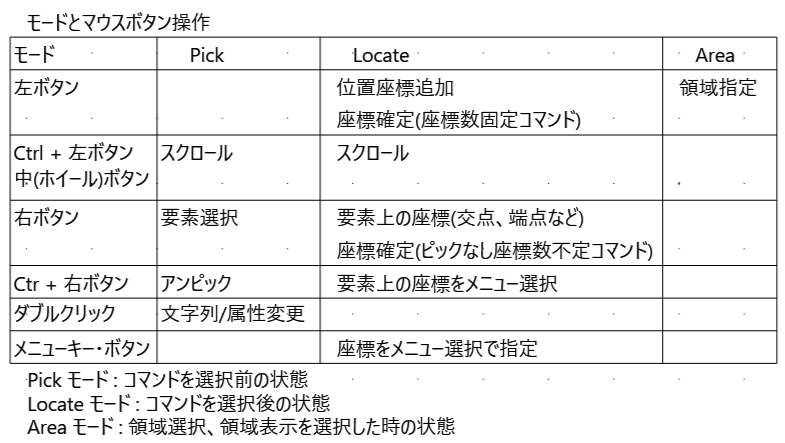

# CadApp
## シンプルに図面の管理ができるCADソフト

ドキュメント作成ツールとしてノートで簡単な製図をするような感覚で使える2次元の機械系CADソフト  
使い方などは[説明書](Document/CadAppManual.pdf)を参照。  
実行方法は[CadApp.zip](CadApp.zip)をダウンロードし適当なフォルダーに展開して CadApp.exe を実行する。  

### ■おもな機能
・図面の管理を大分類、分類、図面名の3段階に分けてシンプルに図面を管理  
・簡単に図面の切替ができ、都度ファイル保存されデータ保存をいしきしなくてよい  
・シンプルなコマンドによる機械系の図面の作成  
・マウスによる操作だけではなくキーボードからの操作も可能  
・図形データからシンボルの作成、配置、管理  
・レイヤーによる図面管理でデータの重ね合わせで部分表示が可能  
・図形データをクリップボードにコピーすることで他の図面にデータの移動が可能  
・複数行の文字列が可能でドキュメント作成としても使える  
・イメージデータをCAD図の中に貼付けられる  

### 起動画面  
  

### 作図機能    
   

   

   

   

   

### 作成図面サンプル  
   

#### シンボルを使った電子回路図  
電子回路用のシンボル図形を作成すると電子回路図も作成しやすい  
  
真空管アンプの回路図  
   

基板の部品配置図  
   

 ###  イメージの貼付け
 

 イメージ図からトレースしてCAD図を作成  

### 履歴
2025/02/09	2要素を別々にピックして交点を求める(Alt + RightMouseButton)
2025/01/18  DXFのエキスポート機能追加(netDXFライブラリ使用)  
2024/09/13  グループ機能追加  
2024/09/08  メモ機能追加(モードレスダイヤログと計算機能)  
2024/06/30  シンボルダイヤログに倍率を追加  
2024/06/14  円弧のストレッチを端点または中間点の移動に変更(ストレッチのコピーも追加)  
2024/05/28  R面コマンド追加(線分、円弧、ポリライン、ポリゴン)  
2024/05/27  接続コマンド追加(楕円は除外)  
2024/05/05  ポリライン、ポリゴンで円弧をサポート(ストレッチ、トリム、オフセット、分割)  
2024/04/03  背景色(図面単位)の設定追加  
2024/03/31  要素マスク追加  
2024/03/22  グリッド表示速度若干改善  
2024/03/22  接線コマンドに円または楕円との指定座標とをつなぐ接線を追加  
2024/03/22  バックアップ処理をシステム設定にまとめる  
2024/03/05  クリップボードのイメージトリミング機能追加  
2024/02/04  EntityData.drawingAll()のClippimgをmWorldからmClipBoxに変更しScroll速度を改善  
2024/01/09  文字入力ダイヤログに計算機能(F11),ファイルOpen(F12,ダブルクリック)を追加  
2023/12/23  [編集][属性一括設定]に塗潰し設定を追加(漏れ)  
2023/12/15  [コピー]に[属性変更]コマンドを追加む  
2023/12/05  未使用イメージファイルの削除機能追加  
2023/12/03  Ctrl/Alt + ホィールによる縦横スクロール追加  
2023/12/02  シンボルに点をサポート(参照点として使うことを想定)  
2023/11/29  3線分に接する円弧の作成を追加([接円]コマンド)  
2023/11/21  全バックアップをシステムメニューに追加  
2023/11/20  シンボル選択のダイヤログで図面ごとに分類の初期値の保存を追加  
2023/11/17  マウスのセンターボタン(ホイールボタン)によるスクロールを追加  
2023/11/17  円弧、楕円、ポリゴンの塗潰しを追加、背景表示属性追加  
2023/11/15  要素コピーでイメージデータをクリップボードにコピー追加  
2023/11/10  ショートカットキーのファイル編集追加(システム設定)  
2023/11/10  測定コマンドの結果をクリップボードにコピー追加  
2023/11/08  シンボル変換にParts要素を追加(漏れていた)  
2023/11/07  定期保存機能追加(10操作で保存)  
2023/10/18  水平垂直線分、ショートカットキーのカスタム化、文字フォント設定、イメージ要素、スクリーンキャプチャ追加  
2023/09/02  楕円要素、シンボル要素の追加、レイヤー機能を追加  
2023/07/26  機能追加(数値計算、領域拡大、ファイルフォーマット、属性変更、要素データのコピー貼付け)  
2023/07/15  実行環境初回登録(プロトタイプ)

### ■実行環境
[CadApp.zip](CadApp.zip)をダウンロードして適当なフォルダに展開し、フォルダ内の CadApp.exe をダブルクリックして実行します。  
動作環境によって「.NET 7.0 Runtime」が必要になる場合もあります。  
https://dotnet.microsoft.com/ja-jp/download

### ■開発環境  
開発ソフト : Microsoft Visual Studio 2022  
開発言語　 : C# 10.0 Windows アプリケーション  
フレームワーク　 :  .NET 7.0  
NuGetライブラリ : netDXF  
自作ライブラリ  : CoreLib

