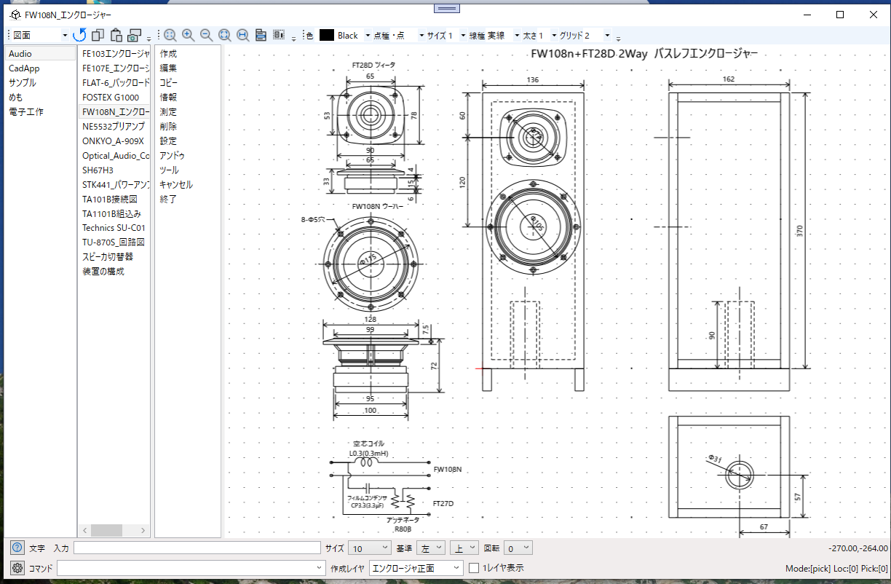

# CadApp
## シンプルに図面の管理ができるCADソフト

図面の管理を大分類、分類、図面名の3段階に分けてシンプルに管理できる2次元CAD  
使い方などは[説明書](Document/CadAppManual.pdf)を参照。  
実行方法は[CadApp.zip](CadApp.zip)をダウンロードし適当なフォルダーに展開して CadApp.exe を実行する。  

### ■おもな機能
・図面の管理を大分類、分類、図面名の3段階に分けてシンプルに管理できる2次元CAD  
・簡単に図面の切替ができ、ファイルの保存を意識しなくもよいようにしている。  
・製図機能は機械系の図面が普通に描ける機能をもつ  
・マウスによる操作だけではなくキーボードからの操作も可能にする

### 起動画面  
  

### 作図機能    
   

### ■実行環境
CadApp.zipをダウンロードして適当なフォルダに展開し、フォルダ内の CadApp.exe をダブルクリックして実行します。  
動作環境によって「.NET 7.0 Runtime」が必要になる場合もあります。  
https://dotnet.microsoft.com/ja-jp/download

### ■開発環境  
開発ソフト : Microsoft Visual Studio 2022  
開発言語　 : C# 10.0 Windows アプリケーション  
フレームワーク　 :  .NET 7.0  
NuGetライブラリ : なし  
自作ライブラリ  : CoreLib

